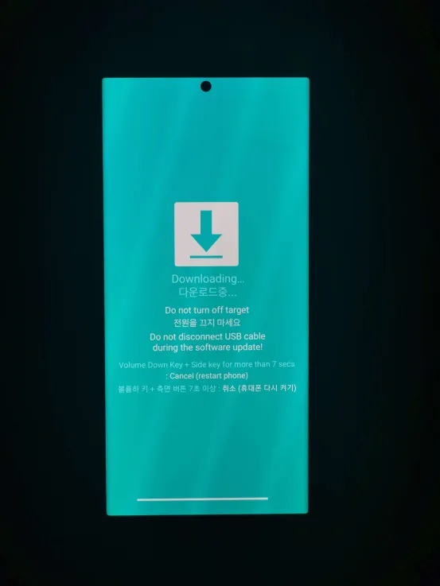

> ⚠️ **Work in Progress:** This guide is still under development. Proceed carefully and at your own risk.  
> This guide is based on the work of **u/fit_freak9** — see the original [Reddit post](https://www.reddit.com/r/GalaxyS23Ultra/comments/1l1hsh0/i_successfully_downgraded_from_one_ui_7_android/#lightbox) for reference.

# ⚠️Disclaimer⚠️ 
### **This process will erase all data and may brick your device if done incorrectly. Proceed at your own risk.**

___

This guide is shared **for educational purposes only**. It is **not official documentation**, and I am **not affiliated with Samsung or Google**.

  

By following this guide, you agree that:

  

- You are proceeding **at your own risk**

- You are **fully responsible** for anything that happens to your device

- I provide this guide **“as is”**, with **no guarantees or warranties**

- I am **not responsible** for any damage, data loss, device failure, or warranty issues

- Any problems caused by incorrect steps, misuse, or unexpected behavior are **not my responsibility**

  

Flashing or downgrading firmware can cause data loss or permanent damage if done incorrectly.

If you do not understand the risks, **do not continue**.

# 📘Guide 

In theory, any Samsung device can be downgraded as long as a compatible firmware exists and you can **safely** access download mode .However, success may vary depending on region, carrier, and current OS version.

**Tested Devices:**
- Samsung Galaxy S23 Ultra (One UI 8, December Patch)
- A35 (One UI 8, December Patch)

**Notes / Limitations:**
- Devices must have **official firmware available** for the target version.  (via samfw)
- Carrier-locked devices may fail or require additional steps.  
- Downgrading from certain security patches may trigger errors or prevent flashing.  
- Always verify your **model number** (e.g., SM-S918B) and **region code** before downloading firmware.  

## Back Up Your Data First (Important) 
**This process **will wipe all data** on your device, including internal storage, apps, and settings.**

I recommend using this tools to backup your data.
 - Samsung smart-switch (Note: Users have reported battery drain when used to restore data)
 - Google Backup
 - External drive (via computer)

>See the [Backup Guide](backup.md) for detailed instructions.

## Before You Start

Ensure all requirements below are met **before** continuing.

- Hardware & System
  - **Windows PC**
  - **USB-C cable** (preferably the original Samsung cable)  
  Using damaged or low-quality third-party cables may cause connection failures or slow transfer speeds.

- Device Preparation
  - **USB Debugging enabled** (Disabled? See [**This Guide**](usb-debugging.md))
  - **All accounts removed** (especially Google and Samsung)  
  >Failure to do this may lead to **failure** 
  See: **[Remove Accounts](#3-remove-accounts--very-important-)** for more

- Required Software & Files
  - **Samsung USB Drivers for Windows**  
  https://developer.samsung.com/android-usb-driver
  - **Odin 3.14**  (Make sure same version)
  https://www.odinflash.com/download
  - **ADB Platform Tools**  
  https://developer.android.com/tools/releases/platform-tools
  - **One UI 6.1 (Android 14) Firmware**  ⚠️
  Download via https://samfw.com
  
⚠️ **Do not proceed until you have read the [Firmware Guide](firmware.md).** ⚠️ 

## Setting Up Your PC
-   Install **Samsung USB drivers** on your Windows PC.
    
-   Download and extract **Odin 3.13**.
    
-   Download and extract **ADB** to a folder (e.g., `C:\Users\YourUserName\Downloads\platform-tools`).
    
-   Extract the firmware file (it should contain files labeled BL, AP, CP, CSC, and HOME_CSC).

## Remove Accounts
**Ensure all accounts are manually removed before proceeding, failing to do so may trigger security locks or synchronization errors**

 1. Open **Settings** and tap **Accounts and backup**.
 2. List item
 3. Tap **Manage accounts**
 4. Select the **accounts** listed 
 5. List item
 6. Tap **Remove account** and confirm.
 7. Repeat for **all accounts**.
> **For the Samsung Account:** You will usually be asked to enter your Samsung password or verify via a "one-time email" to sign out completely.

## Booting into Download mode

 1. Connect your phone to the PC via USB-C.

 2.   Open Command Prompt, and Enter the command below
  

     cd C:\Users\YourUserName\Downloads\platform-tools
    
 3.   Verify the connection:
    
    adb devices
    
   >    Your phone should prompt to allow USB debugging. Select **Always Allow**.
              The command should display your device’s serial number.
        
 4.   Boot into Download Mode:
    
    adb reboot download
    
 5.   Your phone should restart into Download Mode (a blue screen with a warning).

      

## Flash Firmware with Odin

 1.   Open **Odin 3.13** as an administrator.
    
 2.   Confirm your phone is detected (a blue or green box with “COM” will appear in Odin).
    
 3.   Load the firmware files:
    
       Click **BL** and select the file starting with `BL_`.
        
       Click **AP** and select the file starting with `AP_` (this may take a minute to load).
        
       Click **CP** and select the file starting with `CP_`.
        
       Click **CSC** and select the file starting with `CSC_` (use `HOME_CSC` if you want to avoid a factory reset, but `CSC_` is recommended for downgrading).
        
 4.   Ensure all boxes in Odin (e.g., Auto Reboot, F. Reset Time) are checked.
    
 5.   Click **Start**. The process may take 5–10 minutes. 
    
 6.   Odin will display **PASS!** in green upon success, and your phone will reboot.
 7. List item

## Complete the Downgrade

-   If prompted, perform a factory reset:
    
    -   Use the **Volume Up/Down** buttons to navigate and the **Power** button to select **Factory Data Reset**.
        
-   Wait for the phone to fully boot (this may take longer than usual).
    
-   Set up your phone as new or restore from your backup.

# Notes
-   **Warranty**: This process doesn’t void your warranty, and you can upgrade to One UI 7.0 later via official updates.
    
-   **Troubleshooting**:
    
    -   If Odin fails, ensure the correct firmware and USB drivers are used. Try a different USB port or cable.
        
    -   If the phone doesn’t boot, retry the process or seek help from a Samsung service center.
        
-   **Resources**: For Odin or firmware issues, refer to trusted guides on [XDA Developers](https://xdaforums.com) or [samfw.com](https://samfw.com).
    
-   This guide assumes some technical knowledge. If you’re new, watch a video tutorial for visual guidance. I recommend this [Guide](https://www.youtube.com/watch?v=GkcCHDBYDQM) by Tech Jarves

# Acknowledgements

  

This guide is a **community-based compilation** and simplification of existing downgrade methods shared by other users. The steps have been reorganized and rewritten for clarity and ease of understanding.

  

Primary references used:

  

- [I successfully downgraded from One UI 7 (Android 15) to One UI 6.1 (Android 14) without root](https://www.reddit.com/r/GalaxyS23Ultra/comments/1l1hsh0/i_successfully_downgraded_from_one_ui_7_android/#lightbox) — By  **u/fit_freak9** 

  

-  [Tech By Jarves – Downgrade Samsung Firmware with Odin](https://www.youtube.com/watch?v=GkcCHDBYDQM)
 

